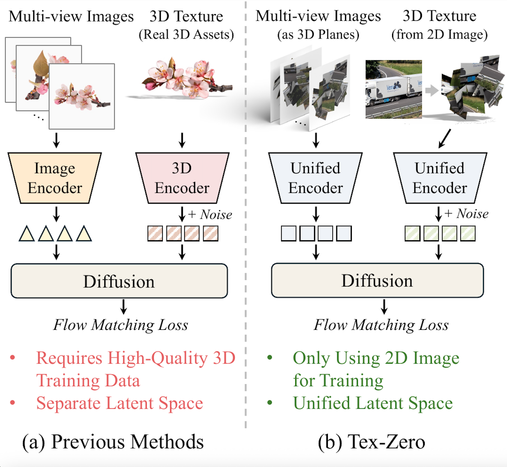
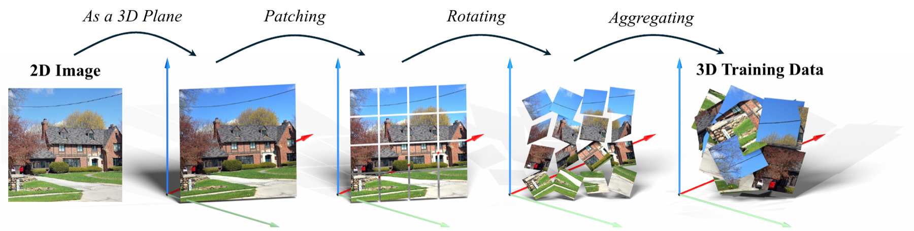
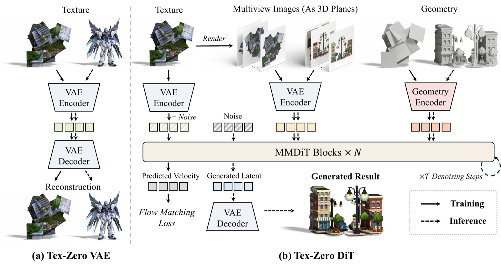
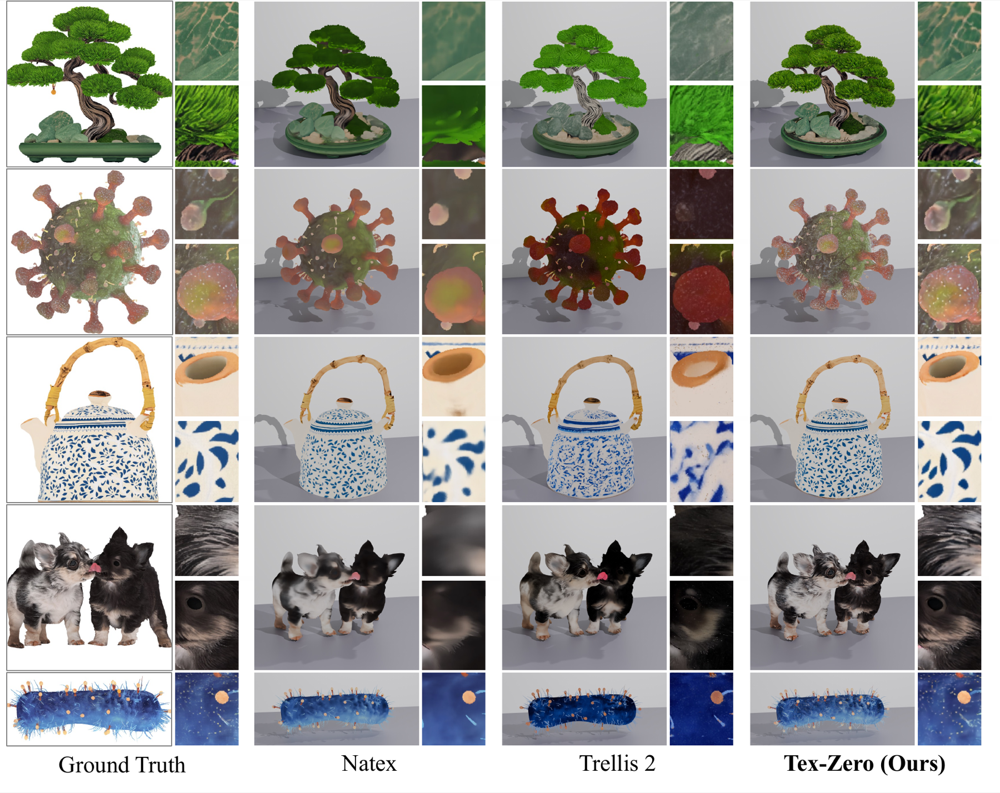

# Does Native 3D Texture Generation Necessarily Require 3D Assets for Training?

Jiangshan Wang1,2 &nbsp;&nbsp; Zeqiang Lai1,2† &nbsp;&nbsp; Jiayi Guo3 &nbsp;&nbsp; Xin Yang2 &nbsp;&nbsp; Xin Huang2  
Jiarui Chen2,4 &nbsp;&nbsp; Ziheng Ouyang2,5 &nbsp;&nbsp; Chunchao Guo2\* &nbsp;&nbsp; Xiangyu Yue1\*

1MMLab, CUHK &nbsp;&nbsp; 2Tencent Hunyuan &nbsp;&nbsp; 3Tsinghua University  
4Fudan University &nbsp;&nbsp; 5Nankai University

†Project lead &nbsp;&nbsp; *Corresponding authors

  

Tex-Zero learns native 3D texture generation using only 2D images, while producing high-quality textured 3D assets at inference time.

## Overview

Tex-Zero is a native 3D texture generation framework trained without real textured 3D assets. It converts high-quality 2D images into effective 3D training samples by representing image patches as planes in 3D space and applying patch-wise random rotations and aggregation.

Using only this image-derived training data, Tex-Zero learns:

- **Tex-Zero VAE**, a unified representation for 2D images and 3D textures that can reconstruct real 3D assets despite never observing them during training.
- **Tex-Zero DiT**, a conditional generative model that encodes multi-view image conditions and target textures in the same latent space for high-fidelity texture generation.

Our results show that high-quality native 3D texture generation does not necessarily require large-scale collections of real textured 3D assets, providing a promising path toward scaling 3D generation with abundant 2D image data.

 

## Data Construction

  

Each 2D image is first represented as a colored plane in 3D space. We divide it into patches, independently rotate the patches, and aggregate them into a sample with complex local geometry while preserving fine-grained texture information. These image-derived 3D samples supervise both the Tex-Zero VAE and Tex-Zero DiT.

## Method

  

The Tex-Zero VAE learns a unified latent representation for image-derived 3D samples and real 3D textures. The Tex-Zero DiT encodes multi-view images as 3D planes, combines their appearance features with geometry conditions, and generates texture latents through flow matching.

## Results

  

Qualitative comparisons show that Tex-Zero preserves finer appearance details and produces textures that more closely match the reference images than representative native 3D texture generation baselines.

## Citation

Citation information will be added soon.
